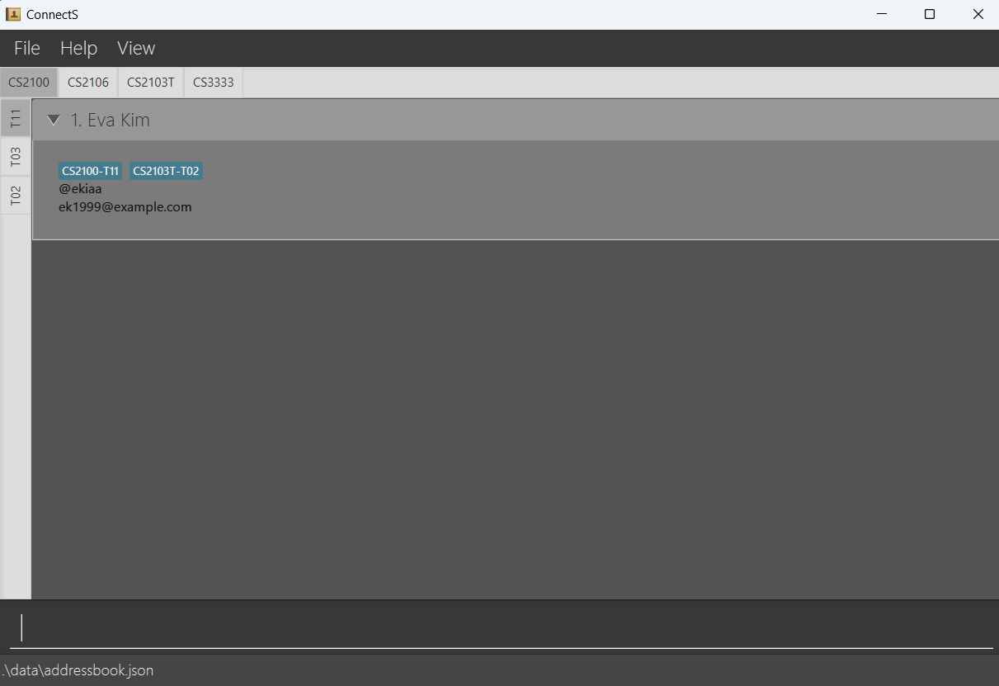

# ConnectS 

## Usage
* Help computing student TAs to manage tutees' contact and information.
  Example usages:
  * Add, delete, and edit a tutee's contact and information.
  * Find 
  * Group tutees by course and tutorial group.
  * Sort contacts by alphabetical order.
  * Search a contact using his/her information.

## Website
* Find user guide and more information [here](https://ay2425s2-cs2103t-f10-4.github.io/tp/index.html)

