# ConnectS User Guide

**Welcome to ConnectS's user guide! As computing teaching assistants(TAs), ConnectS is your best friend in helping you centralise all
your tutees' contact information into one management app.**

ConnectS separates your tutee contacts into their different modules and tutorial groups, and records information you will use the most,
like telegram handles and emails. You can enjoy the many commands available to help you navigate, edit, delete, find and sort through your tutees' information.

If you are fast at typing, ConnectS' command line interface(CLI) specialisation can help you manage your tutee's 
contacts faster than other contact apps, whilst still allowing you to enjoy the convenience of a graphic user interface(GUI).

 

--------------------------------------------------------------------------------------------------------------------

## Table of contents

* [How to use this Guide](#how-to-use-this-guide)
* [Features](#features)
  * [Command Formatting](#command-formatting)
  * [Parameter Formatting](#parameter-formatting)
  * [Popups](#popups)
  * Commands
    * [Getting Help](#viewing-help-help)
    * [Adding a tutee](#adding-a-tutee-add)
    * [Listing all tutees](#listing-all-tutees-list)
    * [Editing a tutee](#editing-a-tutee-edit)
    * [Finding a tutee](#finding-a-tutee-find)
    * [Deleting a tutee](#deleting-a-tutee-delete)
    * [Deleting a module](#deleting-a-module-deletemod)
    * [Deleting a tutorial](#deleting-a-tutorial-of-a-specific-module-deletetut)
    * [Sorting a tutee](#sorting-tutees-sort)
    * [Pinning a tutee](#pinning-tutees-pin-unpin)
    * [Viewing a specific module and tutorial](#viewing-a-tab-view)
    * [Clearing all tutees](#clearing-all-tutees-clear)
    * [Exiting ConnectS](#exiting-connects-exit)
  * [Saving data](#saving-the-data)
  * [Editing save files](#editing-the-data-file)
* [FAQ](#faq)
* [Known issues](#known-issues)
* [Command Summary](#command-summary)
* [Glossary](#glossary)

 

--------------------------------------------------------------------------------------------------------------------

## How to use this Guide

If you are a beginner looking to get started: Visit the [Quick Start](#quick-start) section just below.

If you've already set up ConnectS, visit the [features](#features) section to see what commands are available in ConnectS.

If you are a returning user looking to refresh yourself on command formatting, visit the [command summary](#command-summary) for
a quick overview.

Confused by what certain terms mean? Visit the [glossary](#glossary).

Visit the [table](#table-of-contents) above to quickly access parts of the guide via hyperlink.

 

--------------------------------------------------------------------------------------------------------------------

## Quick start

1. Ensure you have Java `17` or above installed in your Computer. 

   * **For Windows, Linux and Mac**: [Setup Guide](https://www3.cs.stonybrook.edu/~amione/CSE114_Course/materials/resources/InstallingJava17.pdf)

   <box type="info" seamless>
   
   **Mac users:** Ensure you have the exact JDK version prescribed [here](https://se-education.org/guides/tutorials/javaInstallationMac.html).
   </box>
   
2. Download the latest `.jar` file from [here](https://github.com/AY2425S2-CS2103T-F10-4/tp/releases/tag/v1.3).

3. Create a new folder where you want to store ConnectS, and place the `.jar` file inside.

4. Open a command terminal, `cd` into the folder you put the jar file in.
   
   * Guide to open command terminal in the `.jar` folder: 

     * **For Windows and Linux**: Navigate to the folder, then right-click in the folder and select "open in terminal" or "Open PowerShell window here"

     * **For Mac users**: [Terminal Guide](https://support.apple.com/en-sg/guide/terminal/trmlb20c7888/mac#:~:text=On%20your%20Mac%2C%20open%20a,window%3A%20Choose%20Open%20in%20Terminal.)
 
5. Use the `java -jar ConnectS.jar` command to run ConnectS. 
   A GUI like the image below should appear in a few seconds. Note how the app contains some sample data. 
   

6. Type the command in the command box and press Enter to execute it. e.g. typing **`help`** and pressing Enter will list all commands. 
   Some example commands you can try:

   * `list` : Lists all tutee.

   * `add n/John Doe t/@johndoe e/johnd@example.com m/CS2103T-F10` : Adds a tutee named `John Doe` to ConnectS.

   * `delete 3` : Deletes the 3rd tutee shown in the current list.

   * `view m/CS2103T-T02` : Switches the viewing tab to tutorial group T02 under module CS2103T, if it exists.

   * `exit` : Exits the app.

7.  Refer to the [features](#features) below for details of each command.

 

--------------------------------------------------------------------------------------------------------------------

## Features

<box type="info" seamless>

### Command Formatting

**Notes about the command format:** 

* When you see a word in `UPPER_CASE`, that word is a parameter that you enter. 
  e.g. in `add n/NAME`, `NAME` is a parameter which can be used as `add n/John Doe`.

* If you see parameters in square brackets, they are optional. 
  e.g. `add [tag/TAG...]` allows for the tag parameter to be omitted.

* If you see parameters in curly brackets, you can use any combination of the parameters, but you
  must have at least one. 
  e.g. `edit INDEX {n/NAME t/TELEGRAM_HANDLE e/EMAIL}` can be used as `edit 1 n/Doe` or as `edit 2 n/Doe t/@JohnDoe` or as `edit 1 e/john@example.com`, but not `edit 1` alone.

* If you see parameters in triangle brackets, you can use any of them, but you must have only one. 
  e.g. `find <n/NAME... t/TELEGRAM_HANDLE... e/EMAIL...>` can be used as `find n/Doe` or `find t/@johndoe`, but not as `find n/Doe t/@johndoe`.

* If you see parameters with `...` after them, it means they can be used multiple times. 
  e.g. `m/MODULE-TUTORIAL_GROUP...` can be used as `m/CS2101-T06`, `m/CS1101S-T55 m/CS2030S-T08` etc.

* You can give parameters in any order. 
  e.g. if the command specifies `n/NAME t/TELEGRAM_HANDLE`, `t/TELEGRAM_HANDLE n/NAME` is also acceptable.

* If you type in extra lines behind commands that don't require parameters (such as `help`, `list`, `exit` and `clear`), it will be ignored. 
  e.g. if you type `help 123`, it will be interpreted as `help`.

* Command words are case-insensitive. 
  e.g. `ADD`, `deLETEMoD` are the same as `add` and `deleteMod` respectively.

* If you are using a PDF version of this document, be careful when copying and pasting commands as some spaces may be omitted.
</box>

 

<box type="info" seamless>

### Parameter Formatting

**Notes about the parameter restrictions:** 

* `NAME` parameters only allow alphanumeric characters, and can have multiple words. 
   e.g. `John`, `John Doe` or `John @123` are allowed, but `John (Doe)` is not.

* `TELEGRAM_HANDLE` parameters only allow one word which must start with `@`, followed by at least 5 alphanumeric characters.
  `_` is allowed, but not at the start or end of the handle.  
   e.g. `@johnny` and `@john_doe` are allowed, but `johnny`, `@john` and `@_john` are not.

* `EMAIL` parameters only allow for the format `LOCAL_PART`@`DOMAIN`.
   * `LOCAL_PART` consists of alphanumeric characters. It can also include `+` `-` `_` `.` characters, but cannot start or end with them.
   * `DOMAIN` consists of `DOMAIN_LABELS`
     * `DOMAIN_LABELS` consists of alphanumeric characters, separated only by hyphens, if any.
     * A `DOMAIN` consists of at least two `DOMAIN_LABELS`, separated by a `.`.
     * The last `DOMAIN_LABEL` must be at least 2 characters long.

   e.g. `john+doe@example.com` is allowed, but `+johndoe@example.com` and `john+doe@example` are not.

* `MODULE-TUTORIAL_GROUP` parameters only allow the format `MODULE`-`TUTORIAL`.
   * `MODULE` and `TUTORIAl` both consist of only alphanumeric characters, and are case-insensitive.
   * `MODULE` and `TUTORIAL` are separated by a hyphen.

  e.g. `cs2103T-t02` is allowed, but `HSI1000 W01` is not.

* `TAG` parameters only allow alphanumeric characters, and can have only one word. 
   e.g. `latecomer` is allowed, but `needs more help` is not.

* `INDEX` parameters refer to the index numbers of the currently displayed tutee list. 
   * Only positive integers are allowed. e.g. `1`, `2`, `3`...
   * Only values that exist within the currently displayed tutee list are allowed. e.g. in the following
     list, `1` and `2` are valid indexes, but `3` and above are not.
     

</box>

<box type="info" seamless>

### Popups
**Notes about popups:** 

* After you input a command, ConnectS will show a popup that gives you an overview of the command's effect. 
  e.g. `add` command's success popup: 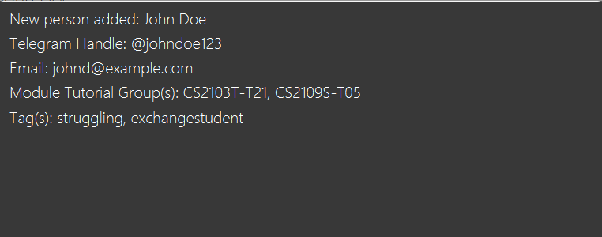

* If you make a mistake in command formatting or provide an invalid parameter, ConnectS will show a popup telling you
  of the mistake. 
  e.g. `add` command's formatting error popup: 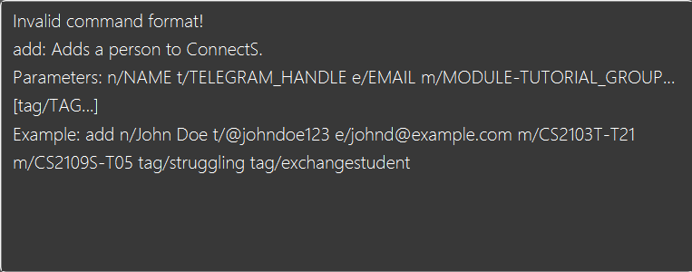

* Popups will be automatically closed whenever you press a key, or click outside of the popup window. Popups don't expire.
</box>

 

--------------------------------------------------------------------------------------------------------------------
### Viewing help : `help`
  
You can find a brief overview of all the commands by using this command.
  
Format: `help`

 

--------------------------------------------------------------------------------------------------------------------

### Adding a tutee: `add`
  
You can add a tutee and their name, telegram handle, email, module-tutorial group and custom tags with this command.
  
Format: `add n/NAME t/TELEGRAM_HANDLE e/EMAIL m/MODULE-TUTORIAL_GROUP... [tag/TAG...]`

* You cannot add tutees with the same name, telegram handle or email as an existing tutee. 
* Case is not taken into account when checking for duplicate names/telegram handles/emails. (e.g. `john` and `John` are considered the same name.)

<box type="tip" seamless>

**Tip:** You may add multiple module-tutorial groups to a single tutee!
</box>
  
Example:
* `add n/John Doe t/@johndoe123 e/johnd@example.com m/CS2103T-T21 m/CS2109S-T05 tag/struggling tag/exchangestudent` adds a tutee with the provided details.
  
This confirmation message will appear:
  
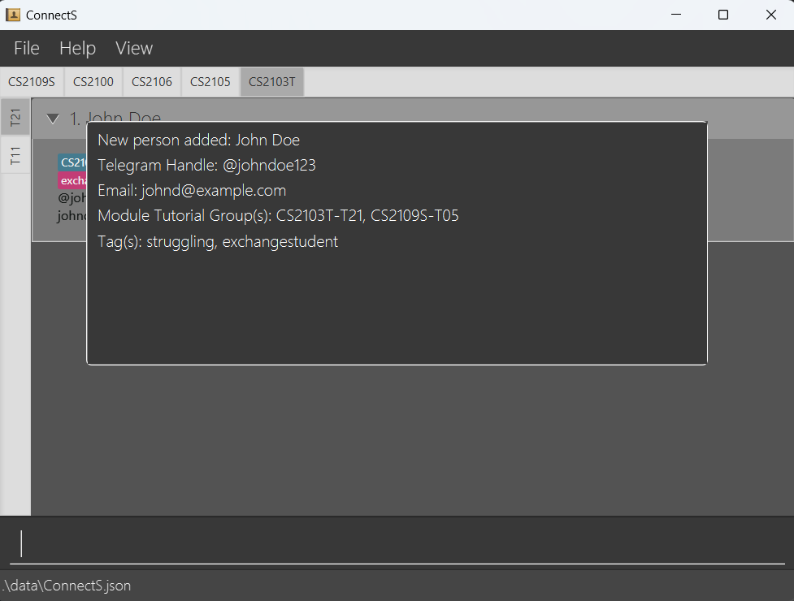

 
 
<box type="tip" seamless>

**Tip:** If you need to add two tutees with the same name, you can use their full names or add numbers to differentiate between them. 
e.g. `John Doe 1` and `John Doe 2` for two tutees named `John Doe`.
</box>

 

--------------------------------------------------------------------------------------------------------------------

### Listing all tutees : `list`
  
You can see all the tutees you added with this command.
  
Format: `list`

* List command will switch the view to the view all tab which displays a list of all tutees.
  
<box type="tip" seamless>

**Tip:** After using this command, use the [view command](#viewing-a-tab-view) to view a specific module's tutorial.
</box>

 

--------------------------------------------------------------------------------------------------------------------

### Editing a tutee : `edit`
  
You can edit a tutee's information with this command.
  
Format: `edit INDEX {n/NAME t/TELEGRAM_HANDLE e/EMAIL m/MODULE-TUTORIAL_GROUP... tag/TAG...}`
  
* Edits the tutee at the specified `INDEX` of the currently displayed list.
* At least one of the optional fields must be provided.
* Existing values will be updated to the input values.
* When editing module-tutorial groups or tags, the existing module-tutorial groups or tags of the tutee will be overwritten. 
* You cannot edit a tutee to have the same name, telegram handle or email as an existing tutee.
* Case is not taken into account when checking for duplicate names/telegram handles/emails. (e.g. `john` and `John` are considered the same name.)
  
Example:
*  `edit 1 t/@johndoey e/johnd@example.com` Edits the telegram handle and email address of the 1st tutee to be `@johndoey` and `johnd@example.com` respectively.
  
This confirmation message will appear:
  
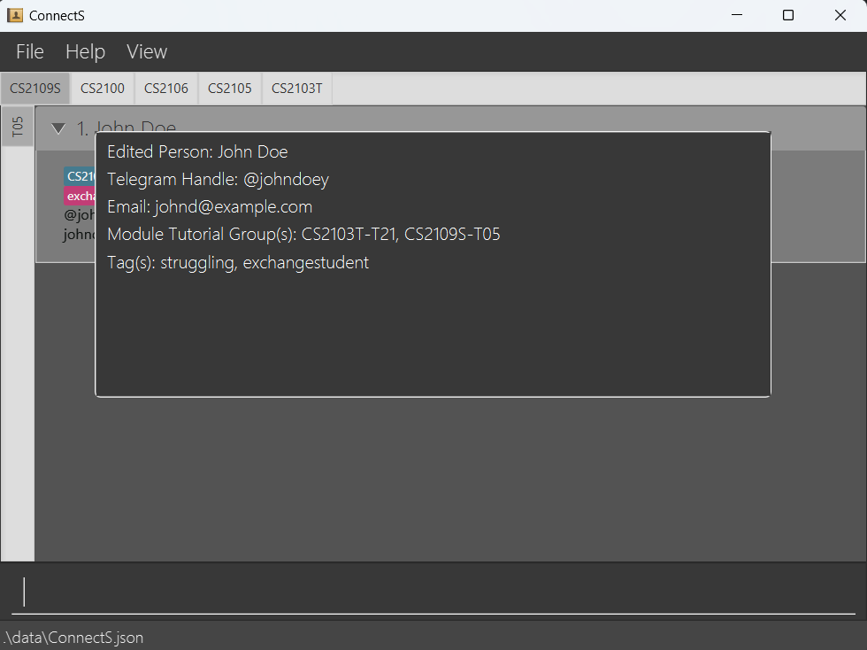

 

--------------------------------------------------------------------------------------------------------------------
### Finding a tutee: `find`
  
Finds tutee whose names contain any of the given keywords.
  
Format: `find <n/NAME_KEYWORD... t/TELEGRAM_HANDLE_KEYWORD... e/EMAIL_KEYWORD...>`
  
* The search is case-insensitive. e.g `hans` will match `Hans`
* The order of the keywords does not matter. e.g. `Hans Bo` will match `Bo Hans`
* Only the name, telegram handle, or email can be searched, and only one at a time.
* Partial words can also be matched e.g. `Han` will match `Hans`
* To search with multiple keywords, only use the corresponding prefix once. e.g. `find n/Alex Bob` is correct, but `find n/Alex n/Bob` is not.
* Tutees matching at least one keyword will be returned (i.e. `OR` search).
  e.g. `Hans Bo` or `an` will return `Hans Gruber`, `Bo Yang`
  
Example:
* `find n/Alex Bernice` returns tutees with names `Alex Yeoh` and `Bernice Yu`. 
  
This confirmation message will appear:

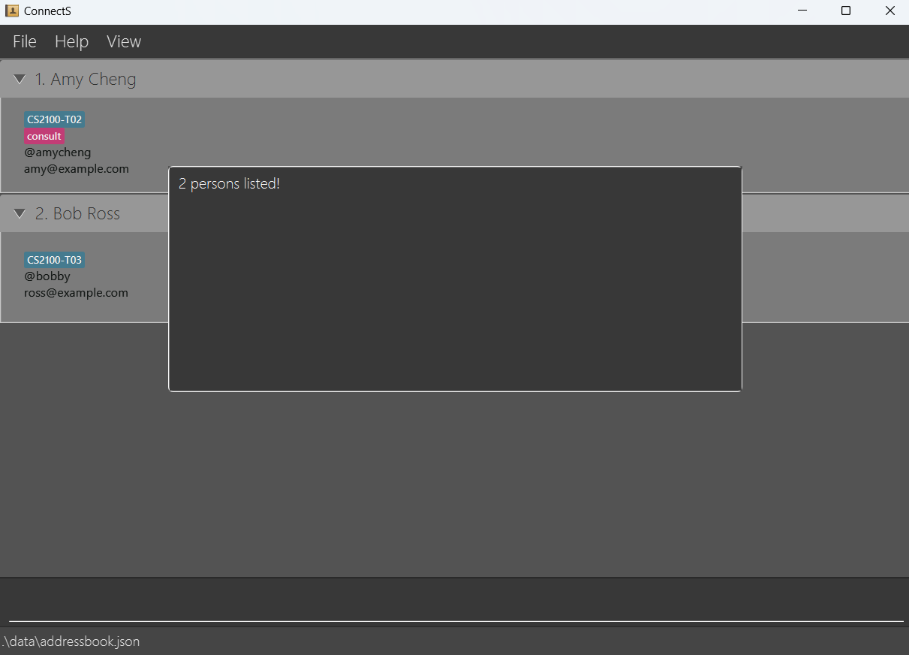

 
 

<box type="tip" seamless>

**Tip:** After using this command, use a [list command](#listing-all-tutees-list) to be able to see all the tutees again.
</box>

 

--------------------------------------------------------------------------------------------------------------------  
### Deleting a tutee : `delete`
  
This deletes the tutee you specify.
  
Format: `delete INDEX`

* Deletes the tutee at the specified `INDEX` of the currently displayed list.
  
Example:
* `find n/John` followed by `delete 1` deletes the 1st tutee in the results of the `find` command.
  
This confirmation message will appear:

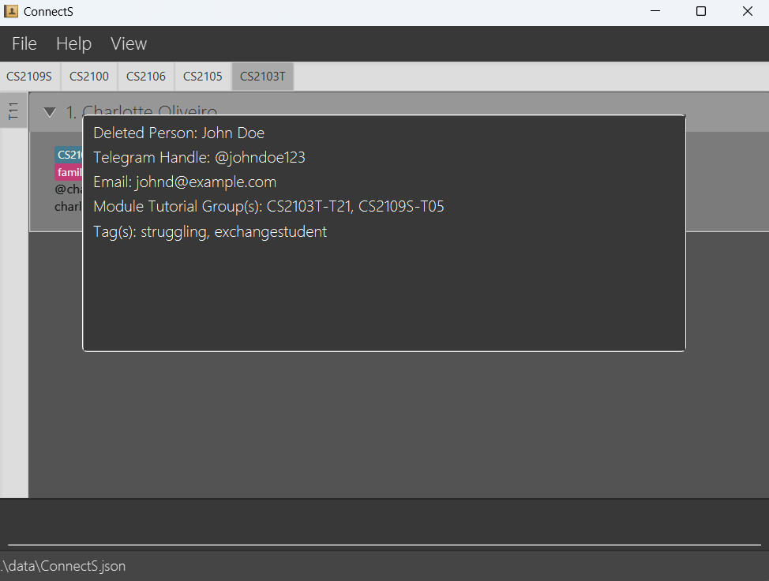

 

--------------------------------------------------------------------------------------------------------------------
### Deleting a module : `deleteMod`
  
You can delete a module with this command. 
  
Format: `deleteMod MODULE_CODE`
  
* The module and all its associated tutorials will be deleted from every tutee's module-tutorial list.
* After the deletion, if a tutee does not belong to any module-tutorial group, they will be automatically deleted.
  
Example:
* `deleteMod CS2109S` deletes the module CS2109S in ConnectS.
  
This confirmation message will appear:

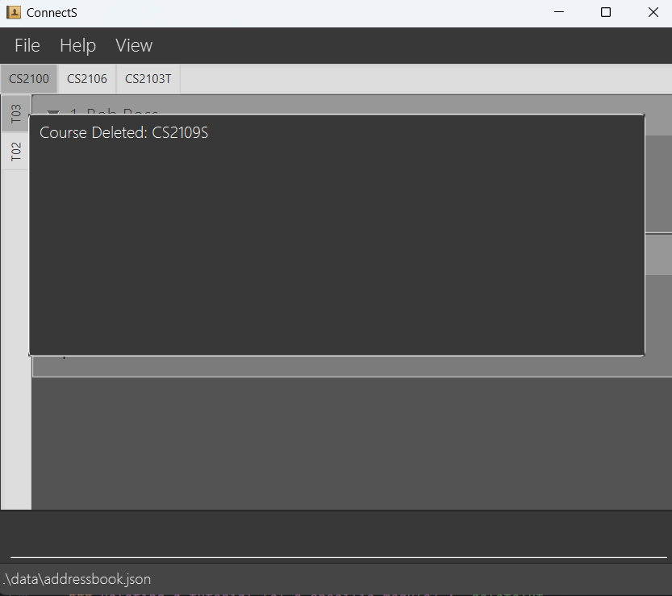

 

--------------------------------------------------------------------------------------------------------------------
### Deleting a tutorial (of a specific module) : `deleteTut`
  
You can delete a tutorial(of a specific module) with this command.   
  
Format: `deleteTut MODULE-TUTORIAL_GROUP`
  
* The tutorial group will be deleted from every tutee's module-tutorial list.
* After the deletion, if a tutee does not belong to any module-tutorial group, they will be automatically deleted.
  
Example:
* `deleteTut CS2103T-T12` deletes the tutorial CS2103T-T12 in ConnectS.
  
This confirmation message will appear:

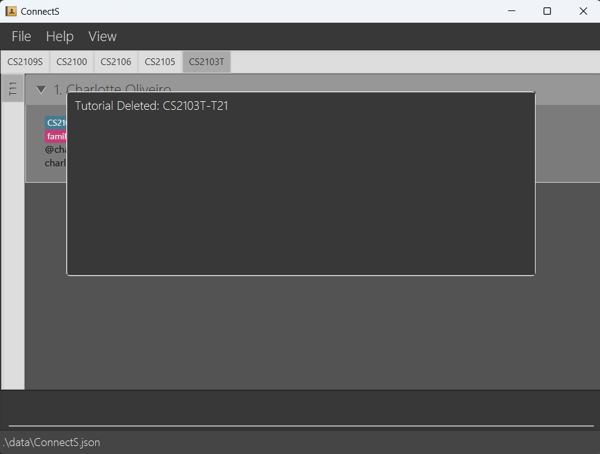

 

--------------------------------------------------------------------------------------------------------------------
### Sorting tutees: `sort`
  
You can sort your tutees in lexicographical order with this command.
  
Format: `sort`

 

--------------------------------------------------------------------------------------------------------------------
### Pinning tutees: `pin`, `unpin`
  
You can pin tutees to always show up at the top of the list, or unpin an already pinned tutee.
  
Format: 
Pin a tutee: `pin INDEX` 
Unpin a tutee: `unpin INDEX`

* Pins/unpins the tutee at the specified `INDEX` of the currently displayed list.
* The pinned tutee(s) will have a blue outline.
* Unpinned tutees will be sent to the bottom of the list.
  
Example:
* `pin 7` pins the 7th tutee in the list.
* `unpin 1` unpins the 1st tutee in the list.
  
How a pinned tutee looks:

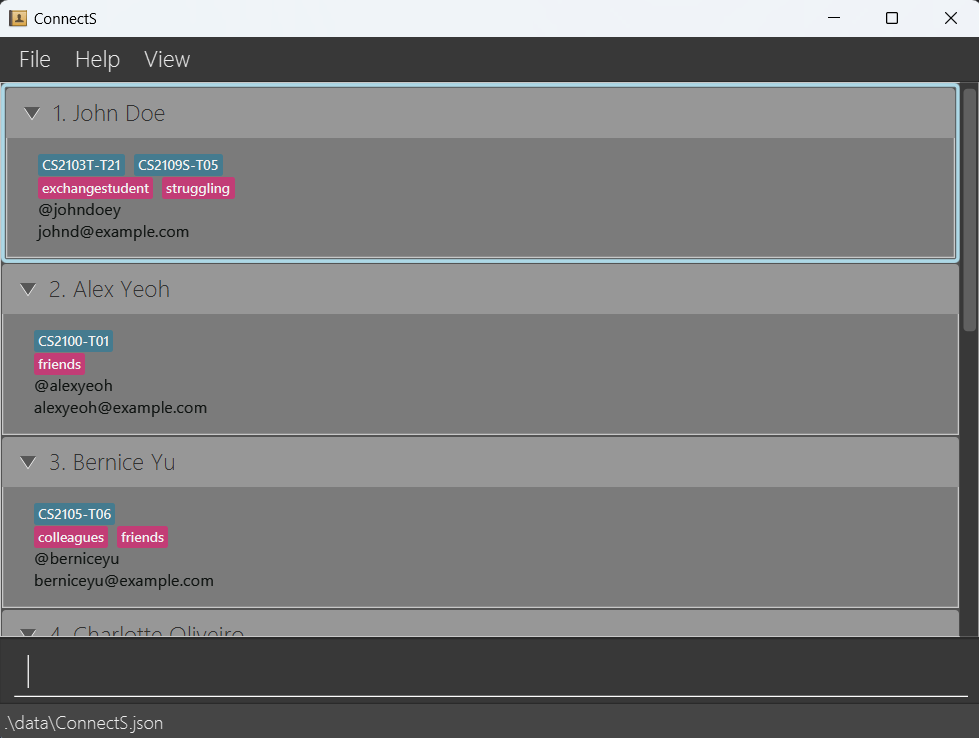

 
 

<box type="tip" seamless>

**Tip:** After unpinning a tutee, use the [sort command](#sorting-tutees-sort) to reorder the tutee that was sent to the bottom of the list.
</box>

 

--------------------------------------------------------------------------------------------------------------------
### Viewing a tab: `view`
  
You can swap the tabs to view a specific module and tutorial, or switch to a view all tab which displays a list of all tutees.
  
Format: `view m/MODULE-TUTORIAL_GROUP`, `view m/all`
  
**View all:**

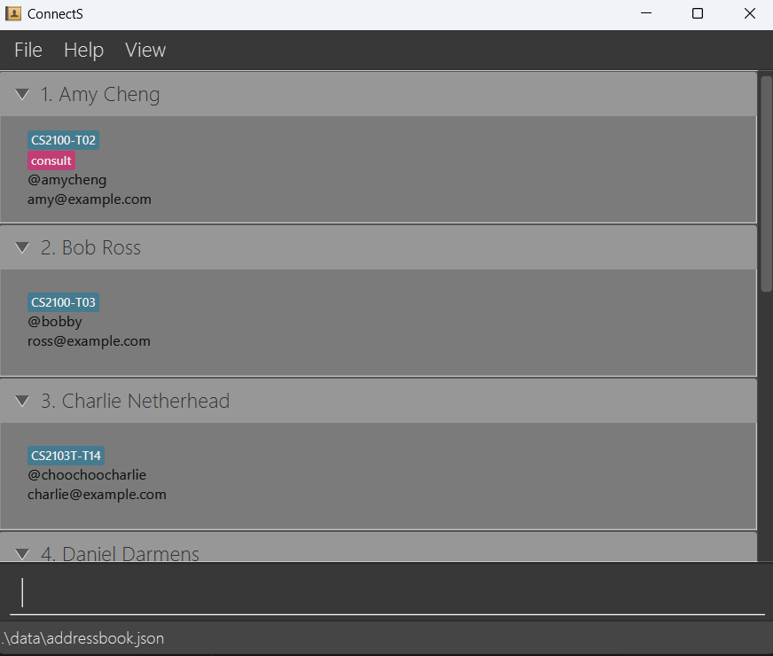

 
 

**View a specific module and tutorial tab:**

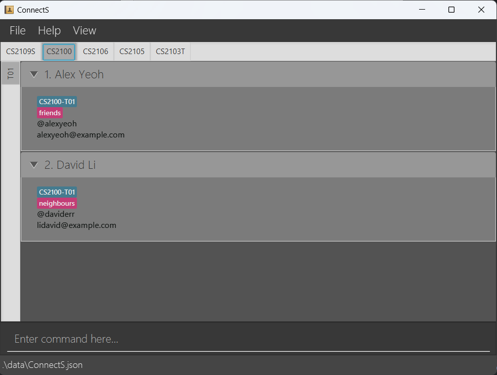
  
 
 

<box type="tip" seamless>

**Tip:** You can also switch to a specific module and tutorial group or a view all tab using the menu buttons.
</box>

 

--------------------------------------------------------------------------------------------------------------------
### Clearing all tutees : `clear`
  
You can delete all tutees from ConnectS with this command.
  
<box type="warning" seamless>

**Caution:**
**This is not reversible!** 
</box>
  
Format: `clear`

 

--------------------------------------------------------------------------------------------------------------------
### Exiting ConnectS: `exit`
  
Bye bye :).
  
Format: `exit`

 

--------------------------------------------------------------------------------------------------------------------
### Saving the data
  
ConnectS data are saved in the hard disk automatically after any command you give that changes the data. There is no need to save manually.

 

--------------------------------------------------------------------------------------------------------------------
### Editing the data file
  
ConnectS data is saved automatically as a JSON file `[JAR file location]/data/ConnectS.json`. You are welcome to update data directly by editing that data file if you're an advanced user.

<box type="warning" seamless>

**Caution:**
If your changes to the data file makes its format invalid, ConnectS will discard all data and start with an empty data file at the next run.  Hence, it is recommended to take a backup of the file before editing it. 
Furthermore, certain edits can cause the ConnectS to behave in unexpected ways (e.g., if a value entered is outside the acceptable range). Therefore, edit the data file only if you are confident that you can update it correctly.

</box>

 

--------------------------------------------------------------------------------------------------------------------

## FAQ

**Q**: How do I transfer my data to another Computer? 
**A**: Install the app in the other computer and overwrite the empty data file it creates with the file that contains the data of your previous ConnectS home folder.

 

--------------------------------------------------------------------------------------------------------------------

## Known issues

1. **When using multiple screens**, if you move the application to a secondary screen, and later switch to using only the primary screen, the GUI will open off-screen. The remedy is to delete the `preferences.json` file created by the application before running the application again.
2. **If you minimize the Help Window** and then run the `help` command (or use the `Help` menu, or the keyboard shortcut `F1`) again, the original Help Window will remain minimized, and no new Help Window will appear. The remedy is to manually restore the minimized Help Window.
3. **`deleteMod` and `deleteTut`** commands will return a success message even if the given `MODULE`/`MODULE-TUTORIAL_GROUP` does not exist.

 

--------------------------------------------------------------------------------------------------------------------

## Command summary

| Action                | Format, Examples                                                                                                                                           |
|-----------------------|------------------------------------------------------------------------------------------------------------------------------------------------------------|
| **Add**               | `add n/NAME t/TELEGRAM_HANDLE e/EMAIL m/MODULE-TUTORIAL_GROUP... [tag/TAG]...`   e.g. `add n/James Ho t/@jameshoho e/jamesho@example.com m/CS2030S-T08` |
| **Clear**             | `clear`                                                                                                                                                    |
| **Delete a Tutee**    | `delete INDEX`  e.g. `delete 3`                                                                                                                         |
| **Delete a Module**   | `deleteMod MODULE`   e.g. `deleteMod CS2103T`                                                                                                           |
| **Delete a Tutorial** | `deleteTut MODULE-TUTORIAL_GROUP`   e.g. `deleteTut CS2103T-T01`                                                                                        |
| **Edit**              | `edit INDEX {n/NAME t/TELEGRAM_HANDLE e/EMAIL m/MODULE-TUTORIAL_GROUP... tag/TAG...}`  e.g. `edit 2 n/James Lee e/jameslee@example.com`                 |
| **Find**              | `find <n/NAME... t/TELEGRAM_HANDLE... e/EMAIL...>`  e.g. `find n/James Jake`                                                                            |
| **List**              | `list`                                                                                                                                                     |
| **Sort**              | `sort`                                                                                                                                                     |
| **Pin**               | `pin INDEX`, `unpin INDEX`   e.g. `pin 7`                                                                                                               |
| **View**              | `view m/MODULE-TUTORIAL_GROUP`, `view m/all`   e.g. `view m/CS2103T-T03`                                                                                |
| **Help**              | `help`                                                                                                                                                     |

 

--------------------------------------------------------------------------------------------------------------------

## Glossary

| Term                         | Meaning                                                                                                                                                                                                                                                                                                     |
|------------------------------|-------------------------------------------------------------------------------------------------------------------------------------------------------------------------------------------------------------------------------------------------------------------------------------------------------------|
| **Command Line Interface**   | A texted-based user interface where the user executes functions by typing in commands.                                                                                                                                                                                                                      |
| **Graphical User Interface** | A graphics-based user interface where the user executes functions by using mouse and menus.                                                                                                                                                                                                                 |
| **cd**                       | A terminal command to allows for switching of the current directory.                                                                                                                                                                                                                                        |
| **Parameter**                | Information that you give to a command.                                                                                                                                                                                                                                                                     |
| **Index**                    | Ordering of the tutees, starting from 1.                                                                                                                                                                                                                                                                    |
| **Module-Tutorial Group**    | An input parameter that combines the module and tutorial group numbers of a tutee e.g. `CS2101-T02`.                                                                                                                                                                                                        |
| **Lexicographical**          | A sorting order that sorts according to the unicode of the name, i.e. numbers 0-9 come first, sorted by ascending order, then capital letters by alphabetical order, then lower case letters in alphabetical order. e.g. `Alex123`, `alex456`, `123alex` will be sorted as `123alex`, `Alex123`, `alex456`. |
| **Alphanumeric Characters**  | A group of characters that includes all english alphabet letters(capitalised and not) and numbers 0-9.                                                                                                                                                                                                      |
