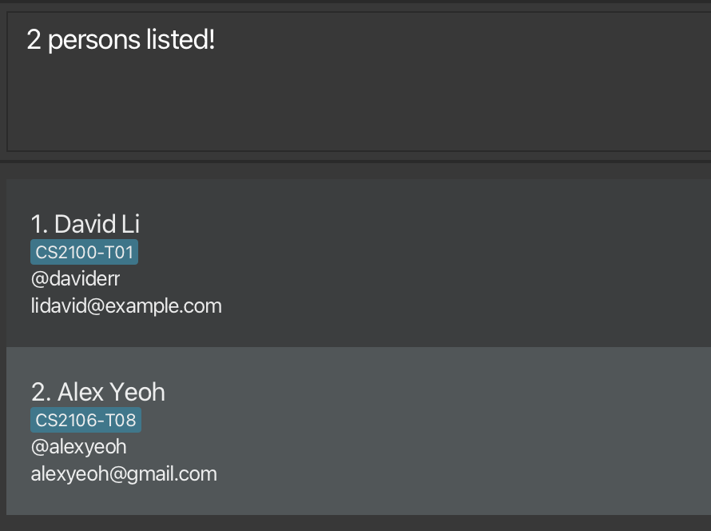

# ConnectS User Guide

**Welcome the ConnectS user guide! ConnectS is any computing teaching assistants(TAs) best friend in helping them
manage their tutees' contact information.**

If you are fast at typing, ConnectS' command line interface(CLI) specialisation can help you manage your contacts faster 
than other contact apps, whilst still allowing you the convenience of a graphic user interface(GUI).

<!-- * Table of Contents -->
<page-nav-print />

--------------------------------------------------------------------------------------------------------------------

## How to use this Guide

You can  navigate the guide using the table on the right side of the website. If you're looking to get started, visit the
[Quick Start](#quick-start) section just below. You can also find a [short summary of the commands](#command-summary)
at the end of the guide.

--------------------------------------------------------------------------------------------------------------------

## Quick start

1. Ensure you have Java `17` or above installed in your Computer. 

   [Setup Guide](https://www3.cs.stonybrook.edu/~amione/CSE114_Course/materials/resources/InstallingJava17.pdf)

   **Mac users:** Ensure you have the precise JDK version prescribed [here](https://se-education.org/guides/tutorials/javaInstallationMac.html).

2. Download the latest `.jar` file from [here](https://github.com/AY2425S2-CS2103T-F10-4/tp/releases/tag/v1.3).

3. Create a new folder where you want to store ConnectS, and place the `.jar` file inside.

4. Open a command terminal, `cd` into the folder you put the jar file in.
   
   Guide to open command terminal in the `.jar` folder: 

   Windows and Linux: Navigate to the folder, then right-click in the folder and select "open in terminal" or "Open PowerShell window here"

   [For Mac users](https://support.apple.com/en-sg/guide/terminal/trmlb20c7888/mac#:~:text=On%20your%20Mac%2C%20open%20a,window%3A%20Choose%20Open%20in%20Terminal.)
 
5. Use the `java -jar ConnectS.jar` command to run ConnectS. 
   A GUI similar to the below should appear in a few seconds. Note how the app contains some sample data. 
   

6. Type the command in the command box and press Enter to execute it. e.g. typing **`help`** and pressing Enter will list all commands. 
   Some example commands you can try:

   * `list` : Lists all contacts.

   * `add n/John Doe t/@johndoe e/johnd@example.com m/CS2103T-F10` : Adds a contact named `John Doe` to ConnectS.

   * `delete 3` : Deletes the 3rd contact shown in the current list.

   * `clear` : Deletes all contacts.

   * `exit` : Exits the app.

7.  Refer to the [Features](#features) below for details of each command.

--------------------------------------------------------------------------------------------------------------------

## Features

<box type="info" seamless>

**Notes about the command format:** 

* When you see a word in `UPPER_CASE`, that word is a parameter that you enter. 
  e.g. in `add n/NAME`, `NAME` is a parameter which can be used as `add n/John Doe`.

* If you see parameters in square brackets, you can use any combination of the parameters, but you
  must have at least one. 
  e.g. `edit INDEX [n/NAME t/TELEGRAM_HANDLE e/EMAIL]` can be used as `edit 1 n/Doe` or as `edit 2 n/Doe t/@JohnDoe` or as `edit 1 e/john@example.com`, but not `edit 1` alone.

* If you see parameters in triangle brackets, you can use any of them, but you must have only one.
  e.g. `find <n/NAME... t/TELEGRAM_HANDLE... e/EMAIL...>` can be used as `find n/Doe` or `find t/@johndoe`, but not as `find n/Doe t/@johndoe`.

* If you see parameters with `…`​ after them, it means they can be used multiple times excluding zero times. 
  e.g. `m/MODULE-TUTORIAL_GROUP…​` can be used as `m/CS2101-T06`, `m/CS1101S-T55 m/CS2030S-T08` etc.

* You can give parameters in any order. 
  e.g. if the command specifies `n/NAME t/TELEGRAM_HANDLE`, `t/TELEGRAM_HANDLE n/NAME` is also acceptable.

* If you type in extra lines behind commands that don't require parameters (such as `help`, `list`, `exit` and `clear`), it will be ignored. 
  e.g. if you type `help 123`, it will be interpreted as `help`.

* When you see the `MODULE-TUTORIAL_GROUP` parameter, you will need to specify both module and tutorial group of the contact, separated by a hyphen.
  e.g. `CS2101-T01` is valid, but `CS2101 T01` is not

* If you are using a PDF version of this document, be careful when copying and pasting commands as some spaces may be omitted.
</box>

### Viewing help : `help`

This shows you a list of commands you can use.

Format: `help`

### Adding a person: `add`

This allows you to add a contact to ConnectS.

Format: `add n/NAME t/TELEGRAM_HANDLE e/EMAIL m/MODULE-TUTORIAL_GROUP…​`

<box type="tip" seamless>

**Tip:** You may add multiple module-tutorial groups to a single person!
</box>

Examples:
* `add n/John Doe t/@johndoey e/johnd@example.com m/CS2100-T07`
* `add n/Betsy Crowe m/CS2105-T02 t/@betsymetsy m/CS1231S-T03 e/betsycrowe@example.com`

### Listing all persons : `list`

This shows you a list of all your contacts in ConnectS.

Format: `list`

### Editing a person : `edit`

This edits a contact you specify.

Format: `edit INDEX [n/NAME t/TELEGRAM_HANDLE e/EMAIL m/MODULE-TUTORIAL_GROUP…​]`

* Edits the person at the specified `INDEX`. The index refers to the index number shown in the displayed person list. The index **must be a positive integer** 1, 2, 3, …​
* At least one of the optional fields must be provided.
* Existing values will be updated to the input values.
* When editing module-tutorial groups, the existing module-tutorial groups of the person will be overwritten.

Examples:
*  `edit 1 t/@johndoey e/johndoe@example.com` Edits the telegram handle and email address of the 1st person to be `@johndoey` and `johndoe@example.com` respectively.
*  `edit 2 n/Betsy Crower` Edits the name of the 2nd person to be `Betsy Crower`.

### Locating persons by name: `find`

Finds persons whose names contain any of the given keywords.

Format: `find <n/NAME_KEYWORD... t/TELEGRAM_HANDLE_KEYWORD... e/EMAIL_KEYWORD...>`

* The search is case-insensitive. e.g `hans` will match `Hans`
* The order of the keywords does not matter. e.g. `Hans Bo` will match `Bo Hans`
* Only the name, telegram handle, or email can be searched.
* Only one field can be searched at a time.
* Partial words can also be matched e.g. `Han` will match `Hans`
* Persons matching at least one keyword will be returned (i.e. `OR` search).
  e.g. `Hans Bo` or `an` will return `Hans Gruber`, `Bo Yang`

Examples:
* `find n/John` returns contacts with names `john` and `John Doe`
* `find t/@alex @david` returns contacts with telegram handles `@alexyeoh`, `@david` 
  

### Deleting a person : `delete`

This deletes the contact you specify.

Format: `delete INDEX`

* Deletes the person at the specified `INDEX`.
* The index refers to the index number shown in the displayed person list.
* The index **must be a positive integer** 1, 2, 3, …​

Examples:
* `list` followed by `delete 2` deletes the 2nd person in ConnectS.
* `find Betsy` followed by `delete 1` deletes the 1st person in the results of the `find` command.

### Deleting a module : `deleteMod`

This deletes the module you specify. The module will be deleted from every tutee's module-tutorial
list. If after the deletion, a tutee does not have any item in his/her module-tutorial list,
the tutee will be automatically deleted.

Format: `deleteMod MODULE_CODE`

* Deletes the module as specified.
* If nobody takes the module, deleteMod will return seccessful message without changing any information.

Examples:
* `deleteMod CS2103T` deletes the module CS2103T in ConnectS.

### Deleting a tutorial (of a specific module) : `deleteTut`

This deletes the tutorial group (of a module) you specify. The tutorial group must be of the form 
MODULE-TUTORIAL_GROUP. The tutorial group will be deleted from every tutee's module-tutorial
list. If after the tutorial group is deleted, a tutee does not have any item in his/her module-tutorial list,
the tutee will be automatically deleted.

Format: `deleteTut MODULE-TUTORIAL_GROUP`

* Deletes the tutorial group as specified.
* If nobody takes the tutorial group, deleteTut will return seccessful message without changing any information.

Examples:
* `deleteTut CS2103T-T12` deletes the tutorial CS2103T-T12 in ConnectS.

### Sorting entries: `sort`

This sorts your contacts in lexicographical order.

Format: `sort`

### Pinning a person: `pin`, `unpin`

This pins one person to always show up at the top of the list, or unpins a person.

Format:`pin INDEX`, `unpin INDEX`

* The index refers to the index number shown in the displayed person list.
* The index **must be a positive integer** 1, 2, 3, …​

### Clearing all entries : `clear`

<box type="warning" seamless>

**Caution:**
This deletes all your contacts from ConnectS. 
</box>

Format: `clear`

### Exiting the program : `exit`

Bye bye :).

Format: `exit`

### Saving the data

ConnectS data are saved in the hard disk automatically after any command you give that changes the data. There is no need to save manually.

### Editing the data file

ConnectS data are saved automatically as a JSON file `[JAR file location]/data/ConnectS.json`. You are welcome to update data directly by editing that data file if you're an advanced user.

<box type="warning" seamless>

**Caution:**
If your changes to the data file makes its format invalid, ConnectS will discard all data and start with an empty data file at the next run.  Hence, it is recommended to take a backup of the file before editing it. 
Furthermore, certain edits can cause the ConnectS to behave in unexpected ways (e.g., if a value entered is outside the acceptable range). Therefore, edit the data file only if you are confident that you can update it correctly.
</box>

--------------------------------------------------------------------------------------------------------------------

## FAQ

**Q**: How do I transfer my data to another Computer? 
**A**: Install the app in the other computer and overwrite the empty data file it creates with the file that contains the data of your previous ConnectS home folder.

--------------------------------------------------------------------------------------------------------------------

## Known issues

1. **When using multiple screens**, if you move the application to a secondary screen, and later switch to using only the primary screen, the GUI will open off-screen. The remedy is to delete the `preferences.json` file created by the application before running the application again.
2. **If you minimize the Help Window** and then run the `help` command (or use the `Help` menu, or the keyboard shortcut `F1`) again, the original Help Window will remain minimized, and no new Help Window will appear. The remedy is to manually restore the minimized Help Window.

--------------------------------------------------------------------------------------------------------------------

## Command summary

Action     | Format, Examples
-----------|----------------------------------------------------------------------------------------------------------------------------------------------------------------------
**Add**    | `add n/NAME t/TELEGRAM_HANDLE e/EMAIL m/MODULE-TUTORIAL_GROUP…​`   e.g., `add n/James Ho t/@jameshoho e/jamesho@example.com m/CS2030S-T08`
**Clear**  | `clear`
**Delete** | `delete INDEX`  e.g., `delete 3`
**Edit**   | `edit INDEX [n/NAME] [t/TELEGRAM_HANDLE] [e/EMAIL] [m/MODULE-TUTORIAL_GROUP]…​`  e.g.,`edit 2 n/James Lee e/jameslee@example.com`
**Find**   | `find <n/NAME... t/TELEGRAM_HANDLE... e/EMAIL...>`  e.g., `find n/James Jake`
**List**   | `list`
**Sort**   | `sort`
**Pin**    | `pin INDEX`
**Help**   | `help`

--------------------------------------------------------------------------------------------------------------------

## Glossary

Term   | Meaning
--------------------|-----------------------------------------------------------------------------------------------
**Lexicographical** | A sorting order that sorts according to the unicode of the name, i.e. numbers 0-9 come first, sorted by ascending order, then capital letters by alphabetical order, then lower case letters in alphabetical order. e.g. `Alex123`, `alex456`, `123alex` will be sorted as `123alex`, `Alex123`, `alex456`
**Module-Tutorial Group** | A input parameter that combines the module and tutorial group numbers of a contact e.g. `CS2101-T02`
**Index**| Ordering of the contacts, starting from 1
**Command Line Interface**| A texted-based user interface where the user executes functions by typing in commands.
**Graphical User Interface**| A graphics-based user interface where the user executes functions by using mouse and menus.

